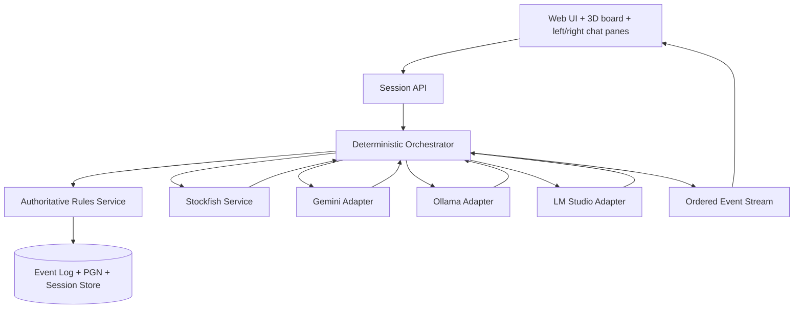
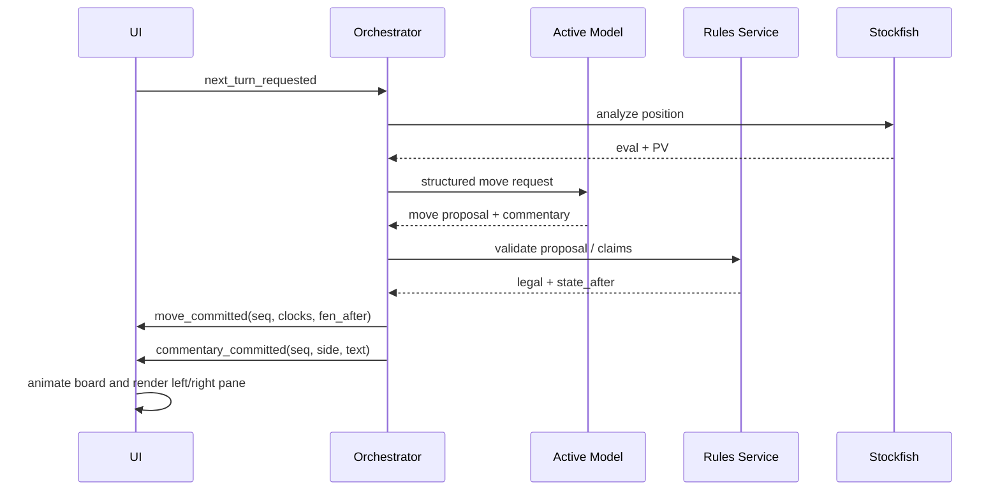
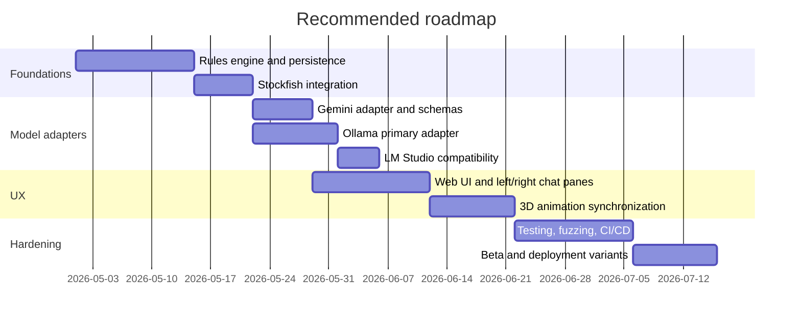

# Design document for a FIDE-compliant multi-model chess application

*Downloadable PDF version:* [chess_design_document.pdf](sandbox:/mnt/data/chess_design_document.pdf)

## Executive summary

The strongest design for this application is an **authoritative chess state machine** surrounded by interchangeable model adapters. In other words, the rules engine and game-state service decide what is legal, what the clocks show, whether a draw can be claimed, and when the game is over; the cloud and local LLMs only propose moves and generate on-screen commentary. That architecture is the cleanest way to satisfy the current FIDE Laws of Chess while still supporting the three deployment modes you asked for: **Gemini vs Gemini**, **Gemini vs local**, and **local vs local**. It also matches the current technical reality of the surrounding tooling: the stable Gemini 2.5 Pro and 2.5 Flash models both support function calling and structured outputs through the Gemini API; Ollama provides native chat, structured outputs, tool calling, Docker guidance, and OpenAI-compatible endpoints; LM Studio provides a local REST server, OpenAI-compatible endpoints, and a headless mode; Stockfish is a UCI engine rather than a complete GUI application; and Docker Compose is explicitly designed for multi-container application stacks. citeturn34search4turn34search5turn38view0turn39view0turn17view5turn19view0turn19view1turn19view2turn19view9turn20view0turn21view0

The most important product decision is to separate **FIDE-exact behavior** from **consumer-friendly behavior**. Under strict FIDE semantics, threefold repetition and the 50-move rule are generally **claim-based**, not automatic; fivefold repetition and 75 moves are automatic; stalemate and dead positions end the game immediately; “quickplay finish” adjudication is tied to announced no-increment procedures and arbiter judgment, not engine centipawns; and monitors showing the board are allowed, but the official result cannot rely only on a screen. In a consumer app, by contrast, it is usually better UX to reject invalid model outputs before they become completed moves, to auto-surface claim opportunities, and to keep the UI synchronized with the server’s official event stream. The report therefore recommends shipping two rules profiles: **Strict FIDE mode** and **Practical app mode**, with the default clearly labeled. citeturn7view3turn27view2turn27view3turn29view0turn30view2

For your stated preferences, the best overall implementation choice is: **Ollama as the primary local runtime**, **LM Studio as a secondary/fallback local runtime**, **Stockfish for analysis and move sanity checking**, **Gemini 2.5 Flash as the default fast cloud player/commentator**, and **Gemini 2.5 Pro as the premium deep-reasoning cloud player/commentator**. The best product roadmap is to build mode **B** first—**Gemini vs local**—because it exercises both clouds and local inference, surfaces orchestration bugs early, contains API cost better than cloud-vs-cloud, and avoids the heavy hardware requirements of two simultaneous local mid-sized models. citeturn39view0turn38view0turn19view0turn19view9turn20view2turn26view2

## Scope, goals, and assumptions

The goal is a **downloadable chess application** with a strong UI, 3D board animation, and two visible “voices” on screen—left and right—corresponding to the two players. Based on your clarification, **TTS and voice output are out of scope for the MVP**; commentary should appear as text bubbles, panels, captions, or token-streamed chat. That single change simplifies the system substantially: the MVP can stay on stable text-generation endpoints instead of depending on audio-specific Live/TTS models, audio buffering, speaker diarization, or lip-sync timing. The design below therefore treats any voice support as a future extension rather than a baseline requirement.

Because you did not constrain the programming language or cloud provider, the report assumes a **Python backend** with a **browser-based frontend**. That is not arbitrary. A Python backend aligns well with Stockfish integration and the existing chess stack because python-chess already provides move generation, validation, FEN handling, draw-claim checks, repetition helpers, and UCI/XBoard engine communication primitives, while Stockfish itself is documented as a UCI engine that should be integrated through a GUI or API rather than treated as a complete user-facing application. citeturn22search0turn36view1turn9search1turn20view0turn20view2

A second assumption is that **orthodox chess only** is in scope for the first release. The FIDE Laws page you referenced remains the current handbook entry used by contemporary 2026 FIDE regulations, and that page covers orthodox chess, rapid, blitz, and appendices such as games without increment. Chess960 is supported by the Laws, but it introduces castling edge cases and notation complications that are not necessary for the first delivery. citeturn34search1turn34search4turn34search5

A third assumption is that the **reference deployment host for local inference should be Linux x86_64 with an entity["company","NVIDIA","gpu company"] GPU** if you want the most predictable Dockerized local experience. Ollama publishes official Docker instructions for CPU-only, NVIDIA GPU, AMD ROCm, and Vulkan modes, and its FAQ notes that GPU acceleration in Docker is available on Linux or Windows with WSL2, but not on Docker Desktop for macOS because GPU passthrough is unavailable there. LM Studio is perfectly viable locally, including offline and headless usage, but it is better treated as a workstation/server fallback than as the primary containerized runtime, especially since you explicitly chose Ollama as the primary local stack. citeturn35search0turn35search1turn19view5turn33view0

### Recommended scope boundary

The MVP should include the following:

| In scope | Reason |
|---|---|
| Standard chess rules under the current FIDE Laws | Core requirement |
| Three deployment modes A, B, and C | Core requirement |
| Visual left/right commentary panes | Matches your clarified UX |
| 3D piece animation synchronized to committed moves | Core requirement |
| Stockfish-based evaluation and candidate ranking | Critical chess quality layer |
| Strict JSON / function-call move proposals | Needed for reliability |
| PGN export and event log | Auditability and debugging |
| Dockerized backend and Ollama deployment | Matches chosen local stack |

| Out of scope for MVP | Reason |
|---|---|
| TTS / Live audio | You explicitly removed it |
| Formal FIDE rating / official online-event compliance | Requires additional regulations and arbiter workflows |
| Chess960 and other variants | Adds complexity without helping the core goal |
| Anti-cheating system | Separate product area |
| Human-vs-human arbiter tooling | Useful later, not required for AI-vs-AI MVP |

That boundary is consistent with the underlying documentation: stable Gemini text models already provide the structured output and tool-use capabilities needed for a robust text-based move pipeline, while LM Studio and Ollama both support local-server patterns and offline/local execution that fit the non-audio MVP well. citeturn38view0turn39view0turn17view0turn17view1turn33view0turn19view9

## FIDE rules mapping to system behavior

The core rule-mapping principle is simple but strict: **the app must never trust a model move because it “looks chess-like.”** It must trust only a move that has been validated against the current authoritative position and event context. Under the FIDE Laws, a move is legal only when the relevant requirements of Articles 3.1–3.9 are met, an illegal move is one that fails those requirements, and the position itself can be illegal if it could not have arisen from legal play. The Laws also explicitly forbid leaving one’s own king under attack and “capturing” the opponent’s king. In software terms, that means every proposed move must pass a legality gate before the application mutates state, starts the opponent’s clock, or animates the board. citeturn7view1turn30view0

### Legal moves, king safety, and illegal-move handling

For an AI-vs-AI app, the best design is **preventive legality**: if a model proposes an illegal UCI move, malformed SAN, impossible castle, invalid promotion, or move from the wrong side to move, the server rejects it before commit. That is better engineering than letting the illegal move “complete” and then trying to emulate arbiter restoration after the fact. However, if you want a more literal FIDE tournament-emulation mode, you can model a completed illegal move as a move that the server mistakenly committed and clock-switched, then restore the prior position, apply the event’s penalty policy, and continue. The critical product point is that these are **two different semantics**, and only the second one is close to over-the-board illegal-move handling. citeturn7view1turn30view0

Because the FIDE appendices modify penalties for some time controls—for example, Appendix A states that penalties mentioned in Articles 7 and 9 become one minute instead of two minutes under the relevant rapid conditions—the implementation should not hardcode a single “illegal move penalty.” Instead, the rules profile should parameterize penalties by event class: standard, rapid, blitz, or custom viewer mode. citeturn30view0

### Promotion, en passant, castling, and repetition

Promotion must be handled explicitly, not heuristically. The Laws define promotion as replacement by a bishop, knight, rook, or queen, and they define when the move counts as completed. For a digital app, the safest approach is to require an explicit `promotion` field in the model output schema and to reject any move to the back rank without it. That is more reliable than silently auto-promoting in normal operation. If you choose to add a strict emulation mode, then incomplete promotion can be treated as an illegal completed move, but that should be clearly labeled as emulation logic, not the default API contract. citeturn7view3turn30view1

En passant and castling rights are not just move-generation details; they are also part of draw-claim correctness. FIDE states that positions are not “the same” for repetition purposes if at the start of the sequence an en passant capture was possible or if castling rights differed. That means your canonical server state must preserve enough information to distinguish otherwise identical-looking boards. In practice, this argues for a canonical state model that always stores at least full FEN-equivalent information and full move history, not just piece placement. That recommendation is reinforced by the Stockfish UCI docs, which explicitly state that using `position ... moves ...` is the recommended way to set up positions because move history allows the engine to handle threefold repetition correctly. citeturn27view2turn28view1turn36view0turn36view1

### Draws, dead positions, claims, and adjudication

This is where many chess apps quietly drift away from the Laws. Under FIDE, **threefold repetition and the 50-move rule are claim-based**, while **fivefold repetition and 75 moves are automatic**. Stalemate and dead positions also end the game immediately. The app therefore needs an explicit concept of **claimable draws** versus **automatic draws**. In strict mode, the active model must be allowed to emit a `claim_draw` action, potentially with an intended move when the claim is based on a move that would create the condition. In practical mode, the server may surface a “this draw can now be claimed” flag and optionally auto-claim on behalf of AI agents, but that should be documented as a non-literal convenience profile. citeturn7view3turn27view2turn28view1

The manuals also matter here. The 2025 Arbiters’ Manual explains the mechanics and consequences of draw claims: claim procedures, what counts as the “same position,” how intended-move claims are checked, and the time penalty for an incorrect claim. That is enough to justify a real server-side `claim_draw` function with validation logic instead of a vague “offer draw” button. citeturn27view2turn28view1

On adjudication, the report’s recommendation is intentionally conservative. FIDE’s no-increment quickplay-finish guidelines apply only if their use was announced in advance, and only to standard or rapid games without increment, not blitz. Those guidelines involve an arbiter assessing whether the opponent cannot win by normal means or is making no effort to win by normal means. That is **not the same thing** as “Stockfish says +6.8, therefore the game is won” or “the engine says 0.00, therefore auto-draw.” Accordingly, the application should **not** use engine-eval auto-adjudication in any mode labeled “FIDE-compliant.” If you later add exhibition-mode adjudication based on engine evaluation, mark it clearly as a **non-FIDE option**. citeturn29view0turn27view3

### Clocks, UI authority, and digital limitations

FIDE treats the completed move and the clock as tightly linked. The app should therefore use a **server-authoritative monotonic clock** and switch the active side at state commit, not after a slow client animation finishes. The UI can animate for 200–350 ms for polish, but that animation is only a projection of the already committed state. This is also consistent with the Laws’ broader distinction between official game state and displayed state: screens and monitors showing the position are allowed, but a player cannot make a claim relying only on information shown that way. In app architecture terms, the UI is informative; the event log and rules service are authoritative. citeturn8view0turn30view2

Finally, some FIDE provisions are inherently physical. The one-hand rule and touch-move rule are about physically touching pieces on a board. A normal digital app cannot automatically enforce those Articles in the strict over-the-board sense unless you add specialized hardware or a very specific interaction contract. The right implementation choice is to document those rules as **non-applicable in ordinary digital play** and to avoid claiming full over-the-board arbiting equivalence. citeturn30view0turn30view1

### Rules profile table

The following table is the cleanest way to operationalize the Laws in software. The rule sources for the behaviors summarized here are the FIDE Laws of Chess and the 2025 Arbiters’ Manual. citeturn7view1turn7view3turn27view2turn29view0turn30view2

| Rule area | Strict FIDE mode | Practical app mode |
|---|---|---|
| Invalid move proposal | Reject before commit unless you explicitly emulate completed illegal moves | Reject before commit |
| Threefold repetition | Claimable only | Server may surface or auto-claim |
| 50-move rule | Claimable only | Server may surface or auto-claim |
| Fivefold repetition | Automatic draw | Automatic draw |
| 75-move rule | Automatic draw | Automatic draw |
| Stalemate / dead position | Automatic | Automatic |
| Promotion | Explicit piece required; invalid if omitted | Explicit piece required |
| Quickplay “normal means” draw | Only if event profile enables no-increment guideline | Usually disabled |
| UI display authority | Informational only | Informational only |

## Architecture and components

The recommended architecture is a **deterministic orchestration core** with provider adapters around it. That choice follows directly from the tooling landscape. Gemini’s stable APIs expose standard request/response and streaming endpoints; the experimental Interactions API adds agent features, MCP, and combined tool workflows, but it is explicitly positioned as an agent-focused API rather than the simplest stable production path. Ollama exposes a native chat API plus structured outputs and tool calling, and it also provides OpenAI-compatible endpoints. LM Studio exposes both a native v1 REST API and OpenAI-compatible endpoints, plus headless server operation through `llmster`. Those interfaces are highly complementary if you design a provider abstraction correctly. citeturn17view5turn17view2turn10search19turn19view0turn19view1turn19view2turn19view3turn19view5turn19view7turn19view9

### Reference architecture flow



This layout is preferable to a “two chatbots directly talk to each other” design because it preserves the separation of concerns. The models never directly mutate board state. They only respond to policy-bounded requests from the orchestrator. The rules service is the only component allowed to create `move_committed`, `result_declared`, or `clock_switched` events. Stockfish is a sibling service, not the source of truth. That is consistent with Stockfish’s nature as a UCI engine and with the need to retain an independent rules layer for FIDE claim semantics, UI synchronization, and error handling. citeturn20view2turn36view0turn27view2

### Domain model

```mermaid
erDiagram
  GAME ||--o{{ MOVE : contains
  GAME ||--o{{ MODEL_RUN : records
  MOVE ||--o{{ COMMENTARY : produces
  GAME ||--o{{ EVENT : emits

  GAME {
    uuid id
    string rules_profile
    string initial_fen
    string result
    string mode
  }

  MOVE {
    int ply
    string uci
    string san
    string fen_after
    int white_ms
    int black_ms
    bool legal
  }

  MODEL_RUN {
    uuid id
    string provider
    string model
    int latency_ms
    int prompt_tokens
    int output_tokens
  }

  COMMENTARY {
    uuid id
    string side
    string visibility
    string text
  }

  EVENT {
    uuid id
    int seq
    string type
    string payload_json
  }
```

Persisting **events**, not just latest board state, is worth the extra effort. The Arbiters’ Manual repeatedly emphasizes replaying and verifying the game sequence when checking claims. An event log also makes debugging substantially easier when comparing Gemini-vs-Gemini and hybrid runs. citeturn27view2

### Component responsibilities

The next table compares the essential components and their recommended responsibilities, based on the official runtime and API documentation. citeturn38view0turn39view0turn19view0turn19view9turn20view0turn21view0

| Component | Recommended role | Notes |
|---|---|---|
| Rules service | Authoritative legality, clocks, draw claims, results | Use python-chess plus custom FIDE claim logic |
| Stockfish | Evaluation, PV, candidate ranking, sanity layer | UCI engine; do not let it be the sole arbiter |
| Gemini 2.5 Flash | Fast cloud player / commentator | Best price-performance and low-latency positioning |
| Gemini 2.5 Pro | Premium cloud player / commentator | Better for deeper reasoning |
| Ollama | Primary local runtime | Native API, structured outputs, tool calling, Docker, OpenAI compatibility |
| LM Studio | Secondary local runtime | OpenAI-compatible server, native v1 REST, offline/headless |
| Docker Compose | Local packaging and multi-service orchestration | Good for backend + Stockfish + Ollama topology |
| Event bus | Ordered delivery to UI | Prevents animation and chat race conditions |

### Stockfish’s role

Stockfish should be used for **evaluation and structure**, not to impersonate a player. Its ideal roles are: generating centipawn or mate evaluations, providing principal variations, ranking a candidate list, verifying engine sanity during testing, and helping produce richer commentary prompts. Its UCI docs also make one crucial point that directly affects your architecture: when setting positions, move history matters for repetition-aware behavior. So the Stockfish adapter should prefer `position startpos moves ...` or `position fen ... moves ...`, not disconnected snapshot-only calls. citeturn20view2

### Gemini choice

For cloud modes, the best production default is **Gemini 2.5 Flash** for the faster side and **Gemini 2.5 Pro** for the stronger side. The official model pages show that both stable models support function calling, structured outputs, thinking, caching, search grounding, and large input/output limits, while neither of those text models is itself the Live API model. In practical terms, Flash is the right default for high-volume move/commentary loops, while Pro is the premium “best move with better explanation” option. citeturn39view0turn38view0

### Ollama and LM Studio choice

Ollama should be primary mainly because it gives you exactly the local deployment surface you need: native chat endpoints, first-class structured outputs, first-class tool calling, Docker deployment docs, and memory/concurrency controls. LM Studio remains very valuable as a fallback or workstation tier because it can run a local server, operate entirely offline, expose OpenAI-compatible endpoints, and run headless through `llmster`. The consequence for your architecture is straightforward: write **one local-model abstraction**, with an Ollama-native implementation as the primary path and an OpenAI-compatible fallback implementation that can point to Ollama or LM Studio. citeturn19view0turn19view1turn19view2turn19view3turn19view5turn19view7turn19view9turn33view0

## Interfaces, APIs, prompts, and synchronization

The interface design should be built around **small, deterministic response contracts**. Do not ask a model to return rich prose first and then try to regex a move out of it. Instead, ask for structured move proposals, validate them, and keep display commentary independent enough that you can stream or trim it without putting legality at risk. That approach is supported directly by both major runtimes in scope: Gemini supports function calling and JSON-schema-based structured outputs, and Ollama supports both tool calling and schema-constrained structured outputs. For Ollama in particular, the official streaming guidance explicitly says non-streaming is better for short responses or structured outputs, which maps perfectly to move proposals; streaming should be reserved for visible banter or commentary. citeturn17view0turn17view1turn19view1turn19view2turn40view0

### Message schemas

A practical server contract should look like this.

```json
{
  "type": "move_request",
  "game_id": "g_123",
  "ply": 27,
  "side": "white",
  "fen": "r2q1rk1/p2bbppp/Q7/2p1P2P/8/2p1B3/PPP2P1P/2KR3R w - - 0 17",
  "clock": {
    "white_ms": 185233,
    "black_ms": 191004,
    "increment_ms": 2000
  },
  "legal_actions": ["move", "claim_draw", "offer_draw", "resign"],
  "stockfish": {
    "eval_cp": 23,
    "pv": ["h5h6", "g7g6", "a6c4"]
  },
  "ui_context": {
    "persona": "confident-grandmaster",
    "commentary_style": "short-left-right-pane"
  }
}
```

```json
{
  "action": "move",
  "uci": "h5h6",
  "promotion": null,
  "commentary": "I gain space on the kingside and keep the structure intact."
}
```

```json
{
  "action": "claim_draw",
  "basis": "threefold",
  "intended_move_uci": null,
  "commentary": "The position has repeated. I claim the draw."
}
```

In strict FIDE mode, the `claim_draw` action is not optional engineering flourish; it is the correct way to preserve the distinction between claimable and automatic draws. The server validates the claim against full state and either ends the game or rejects the claim according to the active rules profile. citeturn27view2turn28view1

### Function-calling pattern

The cleanest tool set for the player models is deliberately small:

- `submit_move(uci, promotion?)`
- `claim_draw(basis, intended_move_uci?)`
- `offer_draw()`
- `resign()`

That is enough for faithful gameplay and keeps the model from “calling the whole application.” Stockfish access, database writes, and UI animation commands should remain **orchestrator-only** operations, not model tools. That boundary makes replay, auditing, and failure recovery much easier. Gemini’s function-calling docs and Ollama’s tool-calling docs support exactly this tool-bridging pattern: models determine when to call a small set of bounded functions; the application executes them. citeturn17view0turn19view2

### Prompt templates

The player prompt should be strict, short, and repetitive enough to reduce drift.

```text
System prompt: You are the White player-commentator in a FIDE-compliant chess application.
You must choose exactly one legal action from the supplied legal_actions list.
Never invent board state.
Use only the supplied FEN, clocks, and analysis hints.
If you choose action=move, return UCI only.
Keep commentary suitable for an on-screen left/right pane.
Do not describe hidden reasoning.
```

A separate commentator or “narrator” prompt can be more expressive, because it never mutates state:

```text
System prompt: You are a concise on-screen chess commentator.
Summarize the latest committed move in one or two sentences.
Use only the committed move, updated FEN, and Stockfish evaluation delta.
Do not invent tactics not supported by the position or PV.
```

This two-prompt structure is better than having one model both choose the move and narrate at length, because it keeps the move path deterministic while still allowing richer presentation. It also plays well with mixed deployments in which the stronger player model and the faster commentator model are different. citeturn39view0turn38view0turn17view1turn40view0

### Synchronization for UI and 3D animation

The move loop should be event-driven.



The critical synchronization rule is this: **the server switches clocks and commits state before or at the same time as the animation event**, not after the animation finishes. If the animation takes 250 ms, the UI is replaying history, not deciding official time. This prevents clock drift and keeps the app aligned with the FIDE distinction between authoritative state and displayed state. citeturn8view0turn30view2

A second important rule is that **only validated commentary should become permanent UI text**. If you stream a model’s text before the move is validated, the user might briefly see an explanation for a move that never gets committed. For that reason, the recommendation is: use **non-streaming structured output** for the move itself, and optionally stream only secondary chatter after validation. Ollama’s own streaming guidance strongly supports this split. citeturn40view0

### Sample backend orchestration

```python
import asyncio
import chess
import chess.engine

class TurnResult(dict):
    pass

class ChessOrchestrator:
    def __init__(self, stockfish_path: str):
        self.board = chess.Board()
        self.engine = chess.engine.SimpleEngine.popen_uci(stockfish_path)

    async def analyze(self):
        info = self.engine.analyse(self.board, chess.engine.Limit(depth=14))
        score = info["score"].white().score(mate_score=100000)
        pv = [m.uci() for m in info.get("pv", [])[:4]]
        return {"eval_cp": score, "pv": pv}

    async def request_move(self, model_adapter, side: str):
        analysis = await self.analyze()
        payload = {
            "fen": self.board.fen(),
            "side": side,
            "stockfish": analysis,
            "legal_actions": ["move", "claim_draw", "offer_draw", "resign"],
        }
        return await model_adapter.get_action(payload)

    def commit_move(self, uci: str) -> TurnResult:
        move = chess.Move.from_uci(uci)
        if move not in self.board.legal_moves:
            raise ValueError(f"Illegal move: {uci}")
        san = self.board.san(move)
        self.board.push(move)
        return TurnResult({
            "uci": uci,
            "san": san,
            "fen_after": self.board.fen(),
            "game_over": self.board.is_game_over(claim_draw=False),
        })
```

This snippet is intentionally conservative: legality is checked by the board object before commit, and Stockfish is used only as an analysis helper. That is the right baseline. The supporting interfaces for python-chess and UCI engine communication are documented, and Stockfish’s own docs reinforce that it is meant to be driven through UCI commands rather than treated as a monolithic app. citeturn22search0turn9search1turn20view2

### Sample Ollama call

```python
import httpx

OLLAMA_URL = "http://localhost:11434/api/chat"

async def ollama_move(model: str, move_request: dict) -> dict:
    schema = {
        "type": "object",
        "properties": {
            "action": {"type": "string", "enum": ["move", "claim_draw", "offer_draw", "resign"]},
            "uci": {"type": ["string", "null"]},
            "promotion": {"type": ["string", "null"], "enum": ["q", "r", "b", "n", None]},
            "basis": {"type": ["string", "null"]},
            "commentary": {"type": "string"}
        },
        "required": ["action", "commentary"]
    }

    body = {
        "model": model,
        "stream": False,
        "format": schema,
        "messages": [
            {"role": "system", "content": "Return only a valid JSON object."},
            {"role": "user", "content": str(move_request)}
        ]
    }

    async with httpx.AsyncClient(timeout=60) as client:
        r = await client.post(OLLAMA_URL, json=body)
        r.raise_for_status()
        return r.json()["message"]["content"]
```

This example follows the native Ollama API pattern rather than the compatibility endpoint because schema-constrained outputs are central to the chess move path. That choice is backed directly by the native Ollama docs for chat and structured outputs. citeturn19view0turn19view1turn40view0

### Sample Stockfish / python-chess integration

```python
import chess
import chess.engine

board = chess.Board()
engine = chess.engine.SimpleEngine.popen_uci("/usr/local/bin/stockfish")

with engine.analysis(board, chess.engine.Limit(depth=16)) as analysis:
    for info in analysis:
        if "score" in info:
            print(info["score"].white())

result = engine.play(board, chess.engine.Limit(time=0.05))
print("Best move:", result.move.uci())

engine.quit()
```

That is the correct general integration shape because Stockfish is a UCI engine and python-chess already abstracts UCI communication. Remember that if you want repetition-aware behavior from the engine during a session, you should keep full move history available rather than feeding isolated board snapshots only. citeturn20view2turn9search1

### Sample Gemini API call

```python
from google import genai

client = genai.Client()

def gemini_move():
    schema = {
        "type": "object",
        "properties": {
            "action": {"type": "string", "enum": ["move", "claim_draw", "offer_draw", "resign"]},
            "uci": {"type": "string"},
            "commentary": {"type": "string"}
        },
        "required": ["action", "commentary"]
    }

    response = client.models.generate_content(
        model="gemini-2.5-flash",
        contents="Choose one legal action for the supplied chess position.",
        config={
            "response_mime_type": "application/json",
            "response_schema": schema
        }
    )
    return response.text
```

For the MVP, the safest Gemini choice is the stable `generateContent` / `streamGenerateContent` path rather than the experimental Interactions API. Use non-streaming JSON for moves and streaming only for visible commentary or observer narration. citeturn17view5turn17view1turn10search19

## Deployment options, latency, hardware, cost, privacy, and security

The three target modes differ less in chess logic than in operational tradeoffs. The current docs support that comparison clearly: Gemini 2.5 Flash is positioned as a low-latency, high-volume model with strong price-performance, Gemini 2.5 Pro is the stronger reasoning model, Ollama and LM Studio both support local/offline execution patterns, and Ollama’s own docs spell out that concurrency and context growth materially affect memory requirements. citeturn39view0turn38view0turn33view0turn26view2

### Deployment comparison

The following table combines direct documentation with explicit engineering inference for latency and hardware planning. Official sources support the model/runtime characteristics; the latency numbers are implementation targets, not provider guarantees. citeturn39view0turn38view0turn26view2turn19view6turn33view0

| Mode | Best use case | Estimated move latency | Privacy posture | Main risk |
|---|---|---:|---|---|
| Gemini vs Gemini | Best polished demo, easiest ops | ~0.8–3.0 s/move | Lowest of the three; cloud data handling applies | Ongoing token cost and internet dependency |
| Gemini vs local | Best overall product balance | ~0.5–2.5 s local side, ~0.8–3.0 s cloud side | Mixed; one side local, one cloud | Asymmetric timing and more orchestration complexity |
| Local vs local | Best privacy / offline mode | ~0.3–3.0 s on capable GPU; often much slower on CPU | Strongest | Hardware demand for two concurrent models |

### Recommended local model tiers

The official Ollama model libraries make one point impossible to ignore: artifact size alone is large enough that **local-vs-local is a real hardware planning problem**. For example, `qwen3.5:9b` is about 6.6 GB, `qwen3.5:27b` about 17 GB, `gemma4:e4b-it-q4` about 9.6 GB, `gemma4:26b-a4b-it-q4` about 18 GB, and `gemma4:31b-it-q4` about 20 GB. Ollama’s FAQ then adds the crucial runtime caveat: parallel processing and larger contexts raise memory use further, and multiple models are only kept loaded if they fit. citeturn25view1turn37view1turn37view0turn37view2turn26view2

| Local tier | Example tags | Practical recommendation |
|---|---|---|
| Small | `qwen3.5:9b`, `gemma4:e4b-it-q4` | Good for single local player/commentator; dual-local viable with care on stronger GPUs |
| Medium | `qwen3.5:27b`, `gemma4:26b-a4b-it-q4` | Good premium local side; usually wants ~24 GB VRAM class hardware or large RAM fallback |
| Large | `gemma4:31b-it-q4` | Best used as a single premium side, not two concurrent copies on one ordinary workstation |

The app-level minimum requirements published by LM Studio—16 GB RAM recommended, with 4 GB dedicated VRAM recommended on Windows—are useful for “will the app run,” but not as a serious planning number for two concurrent chess models with long context and commentary. Use them as **minimums**, not as target production hardware. citeturn19view6

### Cost comparison

Gemini’s current standard pricing is straightforward enough to model. On the standard paid tier, Gemini 2.5 Pro is priced at $1.25 per 1M input tokens and $10 per 1M output tokens for prompts at or under 200k tokens; Gemini 2.5 Flash is $0.30 per 1M input tokens and $2.50 per 1M output tokens. With a realistic chess-turn schema—roughly 1,000 input tokens and 150 output tokens per move over an 80-ply game—that works out to roughly **$0.22/game for a Pro side**, **$0.054/game for a Flash side**, **~$0.27/game for Pro-vs-Flash**, **~$0.44/game for Pro-vs-Pro**, and **~$0.11/game for Flash-vs-Flash**, before any extra observer or narration calls. Those figures are engineering estimates derived from the official rate cards, not official per-game pricing. citeturn31view1

By contrast, Ollama local use is effectively unlimited on your own hardware, while Ollama’s hosted plans are subscription-based and framed around cloud usage rather than fixed token accounting. That reinforces the earlier recommendation: if you expect lots of experimentation and long AI-vs-AI runs, mixed mode B or local mode C is financially safer for development than full cloud-vs-cloud mode. citeturn32view0

### Privacy and security tradeoffs

For cloud privacy, the key Gemini tradeoff is explicit in the pricing docs: **free tier** usage may be used to improve Google’s products, while **paid** usage is documented as not being used that way. If you care about privacy or commercial customer separation, use paid Gemini tiers. citeturn31view1turn31view0

For local privacy, both major local runtimes are strong. LM Studio documents that once the model is on your machine, chatting with models, chatting with documents, and running the local server can all stay entirely on-device. Ollama states that when run locally it does not see your prompts or data; if you use cloud-hosted Ollama models, prompts and responses are processed to provide the service, but the company states that content is not logged or trained on. citeturn33view0turn35search1turn32view0

From a deployment-security perspective, use **Docker Compose secrets** for runtime API keys and **Docker build secrets** for anything needed during image builds. Docker’s own documentation is explicit that build args and environment variables are inappropriate for secrets because they persist in the final image. Compose also supports per-service secret mounting, which is ideal for keeping Gemini credentials out of services that do not need them. citeturn21view2turn21view6

A quiet but important compliance point is licensing. Stockfish is free and open-source, but it is licensed under GPLv3. If you ship Stockfish binaries with the application, review those obligations before distribution. This is not a blocker; it is simply something that should be addressed early rather than at release time. citeturn20view0turn20view4

## Testing, operations, CI/CD, and fallback strategy

A chess application like this needs more than normal web-app testing because the failure modes are unusual. One layer is ordinary software quality; the second layer is rules correctness; the third layer is model unreliability. The cleanest test strategy is therefore layered: **unit tests** for rules, clocks, and claims; **integration tests** for provider adapters and event ordering; and **fuzzing** for malformed or illegal model outputs. python-chess is especially useful here because it already exposes helpers for legal moves, claimable draws, repetition checks, and FEN handling that are ideal for automated tests. citeturn22search0turn36view1

### Minimum testing matrix

| Test type | What it should cover |
|---|---|
| Unit | Move legality, castling rights, en passant window, promotion, stalemate, dead position, clock flip, result precedence |
| Integration | Gemini adapter, Ollama adapter, LM Studio fallback, Stockfish engine lifecycle, event stream ordering |
| Fuzzing | Invalid UCI, malformed JSON, missing promotion piece, impossible draw claims, truncated streaming content |
| Load | Concurrent sessions, local model queuing, cold starts, latency under long commentary context |
| Golden games | Known PGNs with repetition claims, 50-move claims, stalemates, promotions, illegal move edge cases |
| UI sync | Animation ACK timing, dropped frames, duplicate events, reconnect recovery |

The most important fuzz target is **illegal model output**, not just “bad HTTP.” The orchestrator should be explicitly tested against nonsense UCI, self-check moves, wrong-side moves, and contradictory actions. That is how you prevent the models from ever becoming the rules authority.

### CI/CD and packaging

Docker Compose is the right baseline for local and staging deployment because it is designed for multi-container stacks and lifecycle operations. Use a multi-stage Dockerfile for the backend image, Buildx for multi-platform builds if you want amd64 and arm64 artifacts, Compose secrets for runtime credentials, and `depends_on` plus health checks so that services wait on readiness rather than mere process startup. Docker’s documentation is explicit that `depends_on` by itself does not wait for readiness; you must add health-based conditions for that. citeturn21view0turn21view1turn21view3turn21view4turn21view5

A practical CI/CD flow is:

1. Run unit and golden-game tests.
2. Launch ephemeral Stockfish + backend containers for integration tests.
3. If local adapters are in scope for CI, run Ollama service-level tests with a small model tier.
4. Build backend images with multi-stage builds.
5. Push signed images for backend/UI.
6. In staging, deploy Compose or equivalent manifests with secrets injected at runtime.
7. Run smoke tests for all three modes A, B, and C.

### Monitoring and logging

Use **application-level event logging** as the primary monitoring stream: move request, model response, validation result, commit event, commentary render event, and final result. Persist the PGN and the full event stream. That makes post-mortems comprehensible.

For underlying runtime visibility, the official docs already tell you where to look: Ollama documents local log locations and notes that containerized logs go to stdout/stderr, while Docker Compose supports tailing service logs. Those paths should be surfaced into your standard log collection. citeturn26view3turn13search13

Recommended metrics include:

- move proposal latency per provider/model
- invalid proposal rate
- re-prompt rate
- clock desync incidents
- local queue depth and unload/reload count
- Stockfish analysis time
- token usage and cost by game
- game termination cause distribution

### Fallback strategy

The fallback policy should be deterministic, not ad hoc.

| Failure | Fallback |
|---|---|
| Gemini timeout | Retry once with a tighter prompt; then switch to Flash-Lite or local side if configured |
| Local model overloaded | Queue, shrink context/commentary, or switch to a smaller local tag |
| Invalid model move | Reject; resubmit with “previous move illegal” hint and same state snapshot |
| Stockfish unavailable | Continue move generation without eval, but label analysis degraded |
| UI animation lag | Keep server clocks authoritative; replay missed events on reconnect |
| Wrong draw claim | Apply rules-profile policy and continue |

That strategy is consistent with the official local-runtime docs: Ollama queues requests when memory is insufficient to keep more models loaded, and local/server modes can be switched or reduced without changing the higher-level API contract if you implement adapters cleanly. citeturn26view2turn19view7turn19view9

## Recommendation and roadmap

The best overall recommendation is:

- **Core architecture:** deterministic orchestrator + authoritative rules service + event log
- **Chess quality layer:** Stockfish as evaluation and candidate-ranking service
- **Cloud default:** Gemini 2.5 Flash
- **Cloud premium:** Gemini 2.5 Pro
- **Primary local runtime:** Ollama
- **Secondary local runtime:** LM Studio
- **Default deployment mode:** build and harden **Gemini vs local** first
- **MVP UI:** 3D board animation + left/right on-screen commentary panes
- **MVP policy:** no TTS, no audio Live API, no engine-eval adjudication in any mode labeled FIDE-compliant

That recommendation follows directly from the current official docs: Gemini 2.5 Flash is the better low-latency price-performance cloud model, Gemini 2.5 Pro is the stronger reasoning model, Ollama has the richest local deployment surface for your chosen stack, LM Studio is an excellent compatibility fallback, and Stockfish remains the best analysis engine to anchor the chess side. citeturn39view0turn38view0turn19view0turn19view9turn20view0

### Implementation roadmap

The following roadmap is a realistic small-team plan. The effort estimates here are implementation estimates, not vendor-published numbers.



A practical milestone breakdown is:

| Milestone | Deliverable | Estimated effort |
|---|---|---:|
| Foundation | Rules engine, event log, PGN export, Stockfish bridge | 2–3 weeks |
| Cloud mode | Gemini vs Gemini with strict move schema | 1–2 weeks |
| Hybrid mode | Gemini vs Ollama end-to-end | 2–3 weeks |
| Local runtime maturity | LM Studio fallback, local model management | 1–2 weeks |
| UI polish | Left/right panes, animation sync, observer view | 3–4 weeks |
| Hardening | Fuzzing, cost controls, logging, Compose packaging | 3–4 weeks |

For a solid production-ready implementation, **14–20 weeks** is a realistic range for a small team, depending on how polished the 3D experience needs to be and how many local hardware classes you want to support well.

### Primary source links

These citations are the main source links used throughout the report:

- FIDE Laws of Chess and current handbook references. citeturn34search1turn34search4turn34search5
- FIDE Arbiters’ Manual 2025 and quickplay/draw-claim guidance. citeturn27view2turn27view3turn28view1turn29view0
- Gemini API model cards, pricing, function calling, structured outputs, and API reference from entity["company","Google","technology company"]. citeturn38view0turn39view0turn31view1turn17view0turn17view1turn17view5
- Ollama native chat, structured outputs, tool calling, Docker, FAQ, GPU, and pricing docs. citeturn19view0turn19view1turn19view2turn35search0turn26view2turn32view0
- LM Studio REST, OpenAI compatibility, headless mode, offline docs, and system requirements. citeturn19view5turn19view7turn19view9turn33view0turn19view6
- Stockfish site, GitHub, and UCI command docs. citeturn20view0turn20view2turn20view4
- Docker Compose, secrets, startup-order, and multi-platform build docs. citeturn21view0turn21view2turn21view3turn21view4turn21view5turn21view6
- python-chess docs for legality, FEN, draw claims, and engine communication. citeturn22search0turn36view1turn9search1